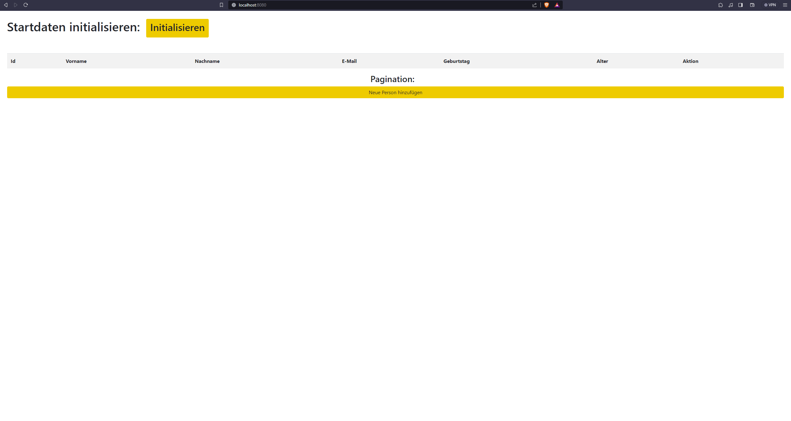
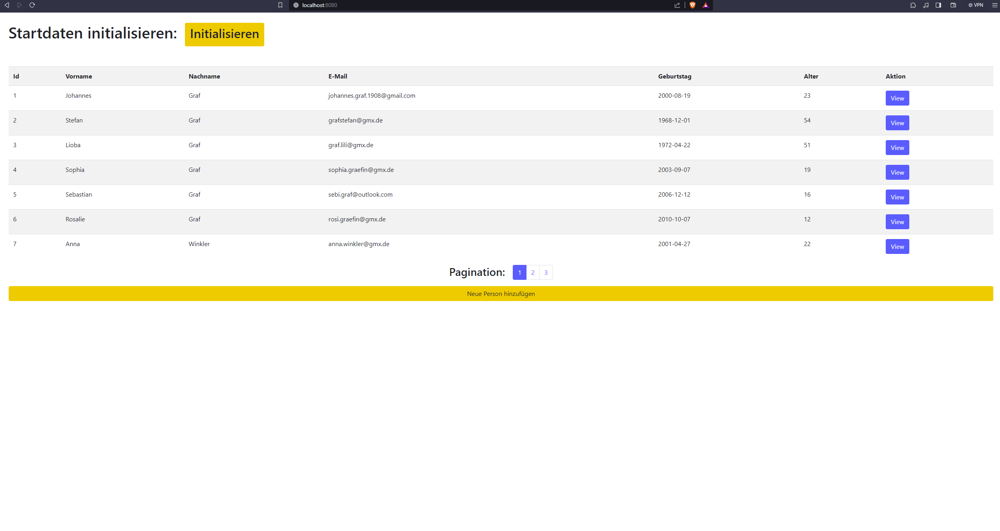
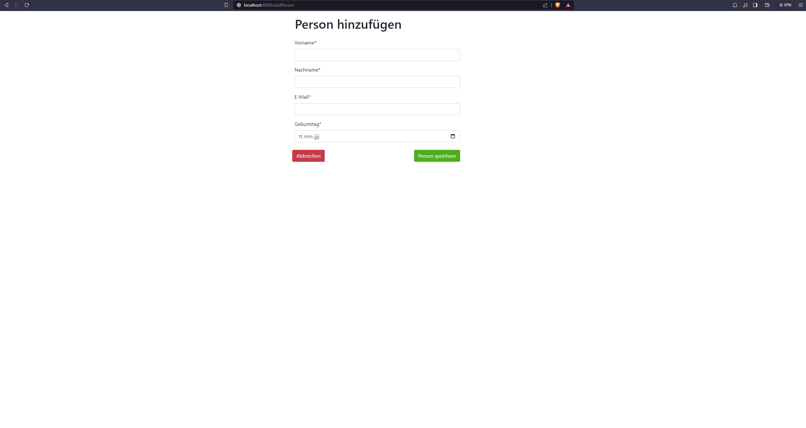
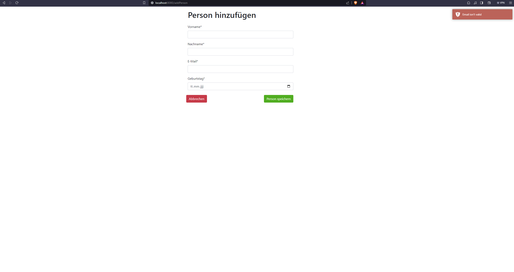
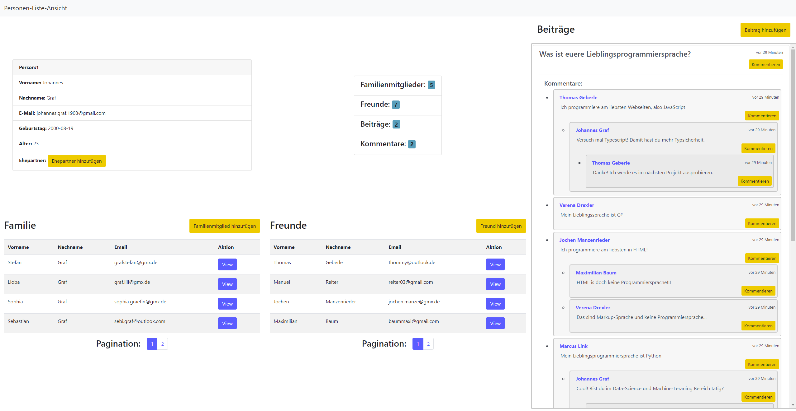
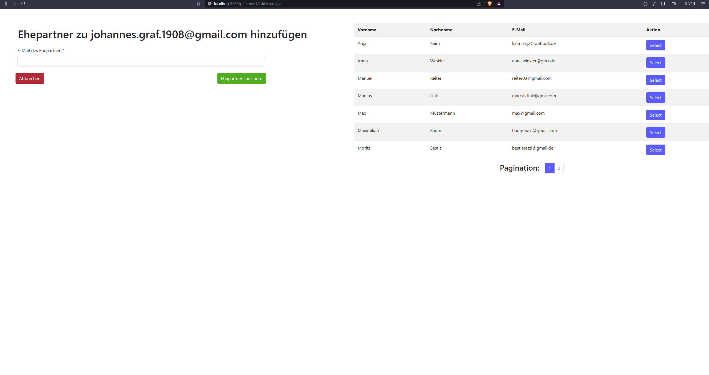
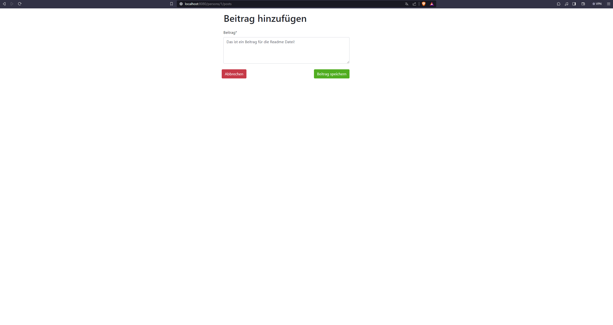
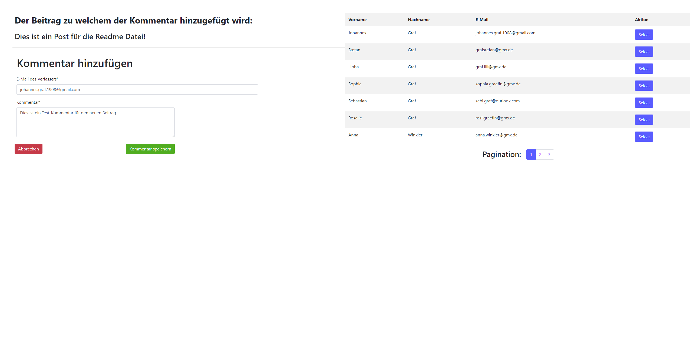
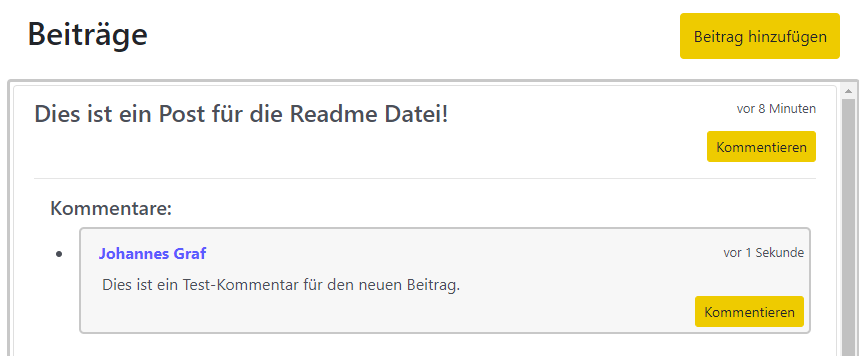

# Java Programmentwurf
Diese Readme Datei enthält grundlegende Informationen über die Bedinung und Funktionsweise dieses Programmentwurfs.

### Entwickelt von Johannes Graf

## Voraussetzungen
<ul>
    <li>eine laufende MySQL Instanz mit einem <i>username</i> von <b>root</b> und keinem Passwort auf Port 3306 (Standardeinstellungen von XAMPP)
    <li>eine leere MySQL Datenbank mit dem Namen <b>pejava</b></li>
    <li>Java Version 17</li>
    <li>Port 8080 muss beim Start der Applikation frei sein</li>
</ul>

## Bemerkungen bezüglich Logik
### 1) Familien-Beziehung
Die Familienbeziehung würde so gelöst, sodass bei Erstellung einer solchen Beziehung die bereits bestehende Familien beider Parteien verknüpft werden. 
Angenommen es existiert die Familie Müller mit: Frau Müller, Herr Müller und Tochter Müller. Außerdem existiert die Familie Maier mit: Frau Maier, Herr Maier und Sohn Maier. Wenn nun zwischen beispielsweise Tochter Müller und Sohn Maier eine Familienbeziehung erstellt wird, sind z.B. auch Frau Maier mit Herr Müller, Herr Maier mit Tochter Müller usw. in einer Familienbeziehung

### 2) Heirats-Beziehung
Heiraten zwei Personen, wird automatisch auch eine Familienbeziehung zwischen den beiden Personen erstellt.

### 3) Beiträge und Kommentare
Für Beiträge und Kommentare existiert nur eine Klasse im Code bzw. eine Tabelle in der Datenbank. Dennoch werden Beiträge und Kommentare in diesem Projekt teilweise voneinander unterschieden.
<ul>
<li>Beiträge sind Elemente, für welche kein Beitrag existiert der in der Hierarchie darüberliegt.</li>
<li>Kommentare sind Elemente, für welche mindestens ein Beitrag existiert der in der Hierarchie darüberliegt.</li>
</ul>

## Bedinungsanleitung
Die Bedinungsanleitung beschreibt kurz die verschiedenen Komponenten, welche in Form von JSP-Dateien als Mock-Up erstellt wurden, um die Funktionsweise der Applikation zu demonstrieren.
### 1) Initialisieren von Beispieldaten
Nach dem Start der Anwendung wird unter der Adresse http://localhost:8080/ die folgende Webseite im Browser sichtbar:

Durch klicken auf den Orangen Knopf <b>Initialisieren</b> (oben im Bild) werden einige Beispieldaten in die Applikation geladen. Bei erneutem Klicken auf diesen Knopf werden immer alle Daten aus der Datenbank entfernt und die Beispieldaten erneut geladen. Das heißt, dass manuell erstellte Daten durch diesen Vorgang verloren gehen. Nach dem Initialisierungsvorgang sollte die Webseite folgendermaßen aussehen:

Diese Seite dient als Einstiegspunkt und Übersicht, um die Daten aller Personen der Datenbank zu visualisieren. Für eine bessere Übersichtlichkeit wurde eine <b>Pagination</b> eingebaut (zentral unter den Personen). Durch das Klicken auf die verschiedenen Seiten kann zwischen den Seiten gewechselt werden.

## 2) Erklärung der Farben
Nachdem die Daten initialisiert wurden ist sichtbar, dass die Webseite neben den dargestellten Informationen aus Elementen mit zwei Farben besteht (später kommen noch zwei weitere Farben hinzu). Dieses Muster zieht sich durch die gesamte Applikation und die Farben haben die folgenden Bedeutungen:
<ul>
    <li><b>Blau</b>: Alle Blauen Knöpfe bezeichnen Elemente, durch welche per Mausklick zu einer Seite mit weiteren Informationen navigiert werden kann. Dementsprechend ist die Pagination blau abgebildet, da zu einer weiteren Seite mit anderen Personen gesprungen werden kann. Außerdem jeder Person der Liste (rechts) ein blauer Knopf zugewiesen, mit welchem auf die Profilseite der jeweiligen Person navigiert werden kann.</li>
    <li><b>Orange</b>: Durch einen Mausklick auf ein Oranges Element werden neue Daten in die Applikation hinzugefügt, oder es wird zu einer Seite navigiert, welche dafür zuständig ist Informationen zu der Applikation hinzuzufügen. Dementsprechend ist der Initialisieren Knopf orange und unten ist ein Knopf zu sehen, wodurch neue Personen in die Applikation eingebunden werden können</li>
    <li><b>Grün</b>: Die eingegebenen Daten werden bestätigt und in die Datenbank übertragen. Diese Knöpfe erscheinen auf Seiten, auf welche durch einen oranges Element navigiert wird</li>
    <li><b>Rot</b>: Die eingegebenen Daten werden verworfen und zur vorherigen Seite zurückgekehrt. Diese Knöpfe erscheinen auf Seiten, auf welche durch einen oranges Element navigiert wird</li>
</ul>

## 3) Hinzufügen von Personen
Durch das klicken des orangen Knopfes mit der Aufschrift <b>Neue Person hinzufügen</b> (unten) wird zu der folgenden Seite navigiert:

Durch die Eingabe von gültigen Informatinen wir eine neue Person erstellt und in die Datenbank abgespeichert. Bei fehlerhaften Angaben wird eine Fehlermeldung mit Informationen über das Problem in der oberen rechten Ecke der Applikation angezeigt. Beispiele für überprüfte Informationen sind:
<ul>
    <li>alle Eingabefelder müssen befüllt sein (am * neben dem Label des Eingabefelds erkennbar)</li>
    <li>die E-Mail muss ein gültiges Format haben</li>
    <li>die E-Mail darf nicht schon vorhanden sein</li>
    <li>der Geburtstag darf nicht in der Zukunft liegen</li>
</ul>
Eine Fehlermeldung für eine ungültige E-Mail würde beispielsweise so aussehen:

## 4) Profilseite
Wird auf der Startseite auf den <b>View</b> Knopf einer Person geklickt, wird auf die Profilseite der Person navigiert. Ich empfehle auf die Profilseite der Person <b>Johannes Graf</b> zu navigieren, da für diese Person die meisten Beispiel-Daten angelegt sind.

Diese Seite ist in verschiedene Abschnitte unterteilt, um alle Informationen darstellen zu können. Diese Abschnitte werden im Folgenden kurz erklärt:

### 4.1) Personen-Liste-Ansicht
Durch einen Mausklick auf <b>Personen-Liste-Ansicht</b> kann wieder auf die Einstiegsseite mit allen Personen in einer Listen-Ansicht navigiert werden.

### 4.2) Profil-Informationen
Unter dem Personen-Liste-Ansicht Schriftzug sind die Informationen der Person einsehbar (oben links). Der Knopf neben Ehepartner unterscheidet sich von Person zu Person. Ist die gewählte Person verheiratet, wird der Name des Ehepartners in einem blauen Element angezeigt (z.B. bei Stefan Graf und Lioba Graf zu sehen). Durch das klicken auf den blauen Knopf wird zum entsprechenden Ehepartner navigiert. Ist die Person unter 18 Jahre alt, ist die Schaltfläche deaktiviert (z.B. bei Rosalie Graf und Sebastian Graf zu sehen). Ist die Person über 18 Jahre alt und noch nicht verheiratet, erscheint ein oranger Knopf (siehe Bild), mit welchem ein neuer Ehepartner hinzugefügt werden kann.

Rechts von den allgemeinen Informationen ist noch eine weitere Ansicht abgebildet (oben Mitte), welche Informationen enthält, wie viele Familienmitglieder, Freunde, Beiträge und Kommentare dieses Profil umfasst.

### 4.3) Familie-Informationen
Unten links sind alle Familienmitglieder der gewählten Person abgebildet. Die Familienmitglieder werden wieder durch eine Pagination dargestellt, um Übersichtlichkeit und Performance zu gewähren. Durch einen Mausklick auf den orangen Knopf <b>Familienmitglied hinzufügen</b> wird zu einer Seite navigiert, auf welcher ein neues Familienmitglied hinzugefügt werden kann.

### 4.4) Freunde-Informationen
Rechts von der Familie sind alle Freunde der Person abgebildet. Die Darstellung ist identisch zu der Darstellung der Familie.

### 4.5) Beiträge und Kommentare
Auf der rechten Seite der Profilseite sind alle Beiträge der Person abgebildet (Beiträge sind etwas anderes als Kommentare, s. Bemerkungen bezüglich Logik). Jeder dieser Beiträge kann einen oder mehrere Kommentare beinhalten und auch die Kommentare können von verschiedenen Personen kommentiert werden. Für alle Beiträge bzw. Kommentare wird angezeigt, wie lange es her ist als der Eintrag in der Datenbank erstellt wurde. Durch einen Klick auf <b>Beitrag hinzufügen</b> kann ein neuer Beitrag für die gewählte Person erstellt werden. Außerdem kann für jeden Beitrag bzw. Kommentar ein Kommentar hinzugefügt werden. Dies durch einen Klick auf den entsprechenden <b>Kommentieren</b> Knopf möglich.

### 5) Hinzufügen von Beziehungen
Es existieren die Beziehungen verheiratet, Familienmitglied und Freund. Der Vorgang zum hinzufügen einer dieser Beziehungen erfolgt über einen Mausklick auf den entsprechenden orangen Knopf der Profilseite der Person. Da der Vorgang für alle Beziehungen nahezu identisch ist, wird im Folgenden nur ein Beispiel gezeigt, wie zu der Person <b>Johannes Graf</b> ein Ehepartner hinzugefügt wird. Nach einem Klick auf <b>Ehepartner hinzufügen</b> erscheint die folgende Seite:

Das hinzufügen eines Ehepartners erfolgt über die Eingabe der entsprechenden E-Mail Adresse in das Eingabefeld. Um den Vorgang zu erleichtern und Fehler zu vermeiden, wird zur rechten eine Liste aller Personen mit einer Pagination angezeigt, welche für eine Eheschließung geeignet sind. Durch das Klicken auf <b>Select</b> der Person in der Liste, mit welcher die Ehe geschlossen werden soll, wird die E-Mail in das Eingabefeld übertragen und der Ehepartner kann über <b>Ehepartner speichern</b> in die Datenbank übertragen werden. Wird diese Hilfestellung nicht verwendet und eine falsche E-Mail eingetragen, erscheint eine Fehlermeldung mit Informationen oben rechts am Bildschirm. Gründe für falsche E-Mail Adressen könnten beispielsweise sein:
<ul>
    <li>eine nicht existierende E-Mail Adresse</li>
    <li>die Person ist bereits verheiratet</li>
    <li>die Person will sich selbst heiraten</li>
    <li>die Person ist unter 18 Jahre alt</li>
</ul>

### 6) Hinzufügen von Beiträgen
Durch das Klicken auf <b>Beitrag hinzufügen</b> auf der Profilseite einer Person kann ein neuer Beitrag hinzugefügt werden:

Der Inhalt des Beitrages muss zwingend in das Textfeld eingegeben werden und kann mit <b>Beitrag speichern</b> abgespeichert werden.

### 7) Kommentieren
Der neue Beitrag könnte nun durch das Klicken auf den <b>Kommentieren</b> Knopf des Beitrags kommentiert werden:

Nachdem links oben nochmals der Beitrag bzw. Kommentar gezeigt wird der kommentiert werden soll, ist darunter das Eingabeformular abgebildet um die Daten einzutragen. Der Verfasser des Kommentars ist standardmäßig der Innhaber der Profilseite. Soll eine andere Person den Kommentar verfassen, kann über das Klicken auf <b>Select</b> der rechts über Pagination abgebildeten Personenliste die Email in das Eingabefeld übernommen werden. Nachdem der Kommentar im Textfeld verfasst wurde kann dieser über <b>Kommentar speichern</b> übernommen werden.

Das Resultat sieht folgendermaßen aus:

 
Der Kommentar könnte wieder kommentiert werden usw. Die Kommentare werden je nach ihrer Hierarchie eingerückt dargestellt. Außerdem kann durch einen Mausklick auf den blau dargestellten namen eines Kommentars zur Profilseite des Verfassers navigiert werden.

## API für externe Dienste
Der Programmentwurf stellt ebenfalls Endpunkte bereit um Daten in einem JSON-Format erhalten zu können, da es für mögliche externe Applikation unvorteilhaft sein könnte, wenn die Informationen nur eingebettet in HTML Seiten zur Verfügung stehen. Bei diesen Endpunkten handelt es sich ausschließlich um <b>GET</b> Endpunkte. Die Endpunkte unterscheiden sich von den anderen Endpunkten durch eine Namenskonvention, bei der immer ein <b>/api</b> bei den Endpunktnamen vorangestellt ist. Dies sind die verfügbaren Endpunkte:
<ul>
    <li><b>/api/persons?page=0&pageSize=5</b>: Stellt alle Personen zur Verfügung. Pagination ist optional, beinhaltet aber die Default Parameter wie links angegeben.</li>
    <li><b>/api/persons/{id}</b>: Stellt eine Person mit der angegebenen {id} zur Verfügung.</li>
    <li><b>/api/persons/{id}/posts</b>: Stellt alle Beiträge einer Person mit allen Kommentaren der Beiträte und der Kommentare der Kommentare des Beitrages zur Verfügung. (Dieser Endpunkt enthält nich zwangsläufig alle Kommentare der Person)</li>
    <li><b>/api/persons/{id}/spouse</b>: Stellt den Ehepartner der Person zur Verfügung.</li>
    <li><b>/api/persons/{id}/friends?page=0&pageSize=5</b>: Stellt alle Freunde einer Person mit der {id} zur Verfügung. Pagination ist optional, beinhaltet aber die Default Parameter wie links angegeben.</li>
    <li><b>/api/persons/{id}/family?page=0&pageSize=5</b>: Stellt alle Familienmitglieder einer Person mit der {id} zur Verfügung. Pagination ist optional, beinhaltet aber die Default Parameter wie links angegeben.</li>
</ul>